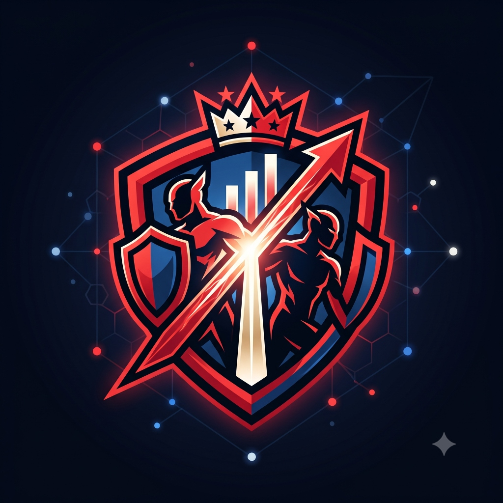

  
  <h1>RivalsConnect</h1>
  
<strong>El Bot Oficial de Estadísticas y Tracking para Marvel Rivals en Discord.</strong>

  

    
    
    
    
  

---

## 📖 Sobre el Proyecto

**RivalsConnect** es un bot avanzado de Discord diseñado para rastrear, procesar y mostrar estadísticas en tiempo real del juego **Marvel Rivals**. Gracias a una integración con Overwolf y una robusta base de datos, el bot ofrece actualizaciones de partidas en vivo, tablas de clasificación, y perfiles de usuario detallados.

### ✨ Características Principales
- **📡 Tracking en Vivo**: Recibe notificaciones automáticas y detalladas de tus partidas (Victoria, Derrota, KDA, Puntos de Captura) al instante.
- **🏆 Tablas de Clasificación (Leaderboard)**: Descubre quiénes son los mejores jugadores del servidor basándose en ELO y MMR.
- **👤 Perfiles Detallados**: Consulta tu historial reciente de partidas, porcentaje de victorias (Winrate), Lords, Champions y tus personajes más jugados (\/profile\).
- **⚙️ Personalización**: Guarda y organiza tus "Lords" y "Champions" preferidos directamente desde Discord (\/configprofile\).
- **🌍 Internacionalización (i18n)**: Soporte completo para múltiples idiomas (Inglés y Español) configurable por usuario (\/language\).

---

## 🚀 Instalación y Despliegue

### Requisitos Previos
- Python 3.10+ (Recomendado 3.13)
- Gestor de procesos PM2 (Opcional, recomendado para producción)
- Un Token de Bot de Discord ([Discord Developer Portal](https://discord.com/developers/applications))

### Pasos de Instalación

1. **Clonar el repositorio:**
   \\\ash
   git clone https://github.com/Svein05/RivalsConnect.git
   cd RivalsConnect
   \\\

2. **Crear y activar el entorno virtual:**
   \\\ash
   python -m venv venv
   # En Linux/macOS
   source venv/bin/activate
   # En Windows
   venv\Scripts\activate
   \\\

3. **Instalar dependencias:**
   \\\ash
   pip install -r requirements.txt
   \\\

4. **Configurar el entorno:**
   Crea un archivo \.env\ en la raíz del proyecto y declara tu token:
   \\\nv
   DISCORD_BOT_TOKEN=tu_token_aqui
   \\\

5. **Iniciar el bot:**
   \\\ash
   python main.py
   \\\
   *Para producción con PM2:*
   \\\ash
   pm2 start main.py --name rivalsconnect --interpreter ./venv/bin/python
   \\\

---

## 🛠️ Estructura del Código

El proyecto sigue una arquitectura modular (MVC y Cogs):

- \/src/cogs\: Contiene los módulos principales del bot (\help\, \profile\, \settings\, \leaderboard\, \live_panel\).
- \/src/database\: Gestión asíncrona de SQLite3 (\db.py\).
- \/src/utils\: Herramientas auxiliares (\parser.py\ para procesar la API de Overwolf, e \i18n.py\ para traducciones).
- \/locales\: Archivos JSON generados por Crowdin para internacionalización.

---

## 🌐 Contribución y Traducción

¡RivalsConnect es impulsado por la comunidad! Si deseas ayudar a traducir el bot a tu idioma materno o mejorar las traducciones existentes, únete a nuestro proyecto en Crowdin:

👉 **[Proyecto de Traducción en Crowdin](https://crowdin.com/project/rivalsconnect)**

Para contribuir al código fuente:
1. Haz un fork del repositorio.
2. Crea una rama desde \develop\ (\git checkout -b feature/nueva-idea\).
3. Envía un Pull Request a \develop\.

---

  Hecho con ❤️ para la comunidad de Marvel Rivals.

